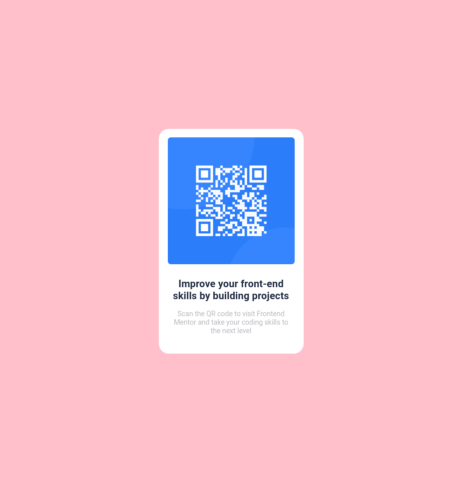

# Frontend Mentor - QR code component solution

This is a solution to the [QR code component challenge on Frontend Mentor](https://www.frontendmentor.io/challenges/qr-code-component-iux_sIO_H). Frontend Mentor challenges help you improve your coding skills by building realistic projects. 

## Table of contents

- [Overview](#overview)
  - [Screenshot](#screenshot)
  - [Links](#links)
- [My process](#my-process)
  - [Built with](#built-with)
  - [What I learned](#what-i-learned)
  - [Continued development](#continued-development)
  - [Useful resources](#useful-resources)

**Note: Delete this note and update the table of contents based on what sections you keep.**

## Overview

### Screenshot



### Links

- [Solution URL](https://raw.githubusercontent.com/juanalbglz/qr-code-component-main/master/index.html)
- [Live Site URL](https://juanalbglz.github.io/qr-code-component-main/)

## My process

Configure the background of the site with the finished image of the project and start building it

### Built with

- Semantic HTML5 markup
- CSS custom properties

**Note: These are just examples. Delete this note and replace the list above with your own choices**

### What I learned

Center a div on the page
```css
body{
      height: 100%;
      position: relative;
    }

    .centered{
      margin: auto;
      position: fixed;
      left: 0;
      top: 0;
      bottom: 0;
      right: 0;
    }
```

### Useful resources

- [Google Fonts](https://fonts.google.com/specimen/Roboto) - Roboto Font for the card.
